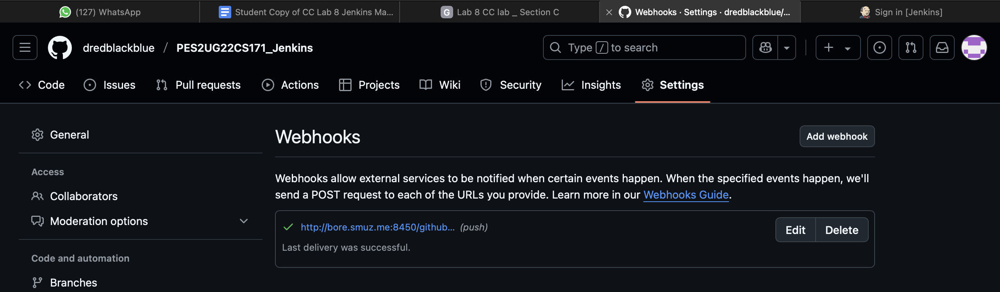
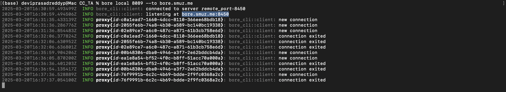
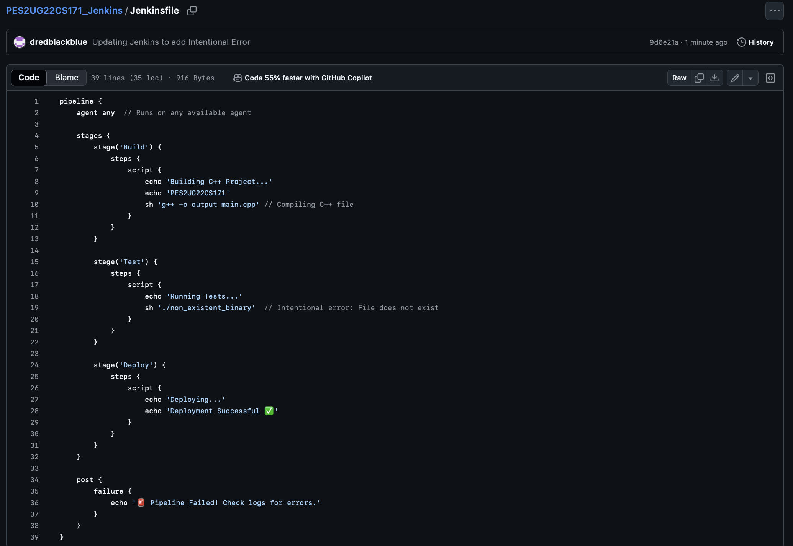

# Jenkins Assignment - CC lab 08

Welcome to your jenkins assignment! This simple exercise is designed to introduce you to Jenkins and continuous integration.

## Introduction to Jenkins

Jenkins is an open-source, Java-based automation tool. This tool automates the software integration and delivery process called Continuous Integration and Continuous Delivery (CI/CD). Jenkins supports various source code management, build, and delivery tools. It provides features like Jenkins Pipelines, which make the delivery process very easy and help teams to adopt DevOps practices seamlessly.

## Overview of the Experiment

1. **Setup Jenkins Using Docker**: Learn how to set up Jenkins in a Docker container.
2. **Set up a Job in Jenkins**: Connect Jenkins to your repository and build a C++ program (`hello.cpp`).
3. **Run the Program**: Set up a second job to run the program after the build completes.
4. **Add a Webhook Trigger**: Automate the execution of jobs in Jenkins by adding a webhook trigger to your GitHub repository.
5. **Create a Basic Jenkins Pipeline**: Understand the basics of Jenkins pipelines.

## Prerequisites

- **Docker**: Installed on your system. (Setup and Installation should have been covered in your previous lab ).
- **Git**: Installed on your system and a GitHub account. Follow this [tutorial](https://www.youtube.com/watch?v=2j7fD92g-gE) to install and familiarize yourself with Git.

Create a GitHub repository with the name as `YOUR_SRN_Jenkins`.

Tasks Results:

Task-1: Setting up Jenkins using Docker
Screenshot-1: Building Jenkins using Docker, We build a docker file which extracts the image from the Docker Registry and builds it on the device

Screenshot-2: Running a Docker container on port: 8089 to access Jenkins

Screenshot-3: Selecting the required Plugins in Jenkins to run git and GitHub

Screenshot-4:Jenkins Home page or Dashboard after installing the required Plugins.

Task-2: Setting up a job in Jenkins to connect to GitHub repository and build a C++ file, hello.cpp
Screenshot-5: Console Output after the successful build of the first Job in Jenkins.

Screenshot-6: Dashboard showing the history of Build and the stable state of the first Job in Jenkins

Task-3: Set up a second job, which run automatically after the build of the first job
Screenshot-7: Console output after the successful build of the second Job

Screenshot-8: Status Page of first job after the successful build of the second Job

Screenshot-9: Dashboard showing the history of build and the stable state of Job’s 1 and 2

Task-4: Add a webhook trigger to your repository in order to automate builds in Jenkin In the previous tasks, we were polling changes from the repository at an interval of every 5 mins. It is an expensive approach. There is, however, a better approach. By adding a Webhook trigger to your repository and connecting it to your Jenkins server, the instant you commit a change to your repository, your job is automatically executed. 
Screenshot-10: Running the bore command in terminal

Screenshot-11:Adding a Webhook to the GitHub repository

Screenshot-12: Console Output after editing hello.cpp and building Job 2

Screenshot-13: Webhook Page in the Github repository after building Job 2

Screenshot-14: The Terminal in which bore command was being run after building the Job 2

Task-5: Building a Basic Jenkins Pipeline
Screenshot-15: Jenkins file in my GitHub Repository

Screenshot-16: Code for main.cpp in the GitHub Repository which prints “Hello, World!”

Screenshot-17: Pipeline Configurations in Jenkins

Screenshot-18: Console Output after building the Pipeline

Screenshot-19: Pipeline Overview after building the Pipeline

Screenshot-20: Dashboard after building the Pipeline

Screenshot-21: Jenkins file in my GitHub Repository after Introducing an Intentional Error in the code

Screenshot-22: Message after running the Pipeline with Updated Jenkins Code after introducing the intentional error in the code

Screenshot-23: Console Output after running the Pipeline with Updated Jenkins Code after introducing the intentional error in the code

Screenshot-24: Pipeline Overview after running the Pipeline with Updated Jenkins Code after introducing the intentional error in the code

Screenshot-25: Dashboard after running the Pipeline with Updated Jenkins Code after introducing the intentional error in the code

End of Results !!!... These Tasks are a Success and they have Ended

